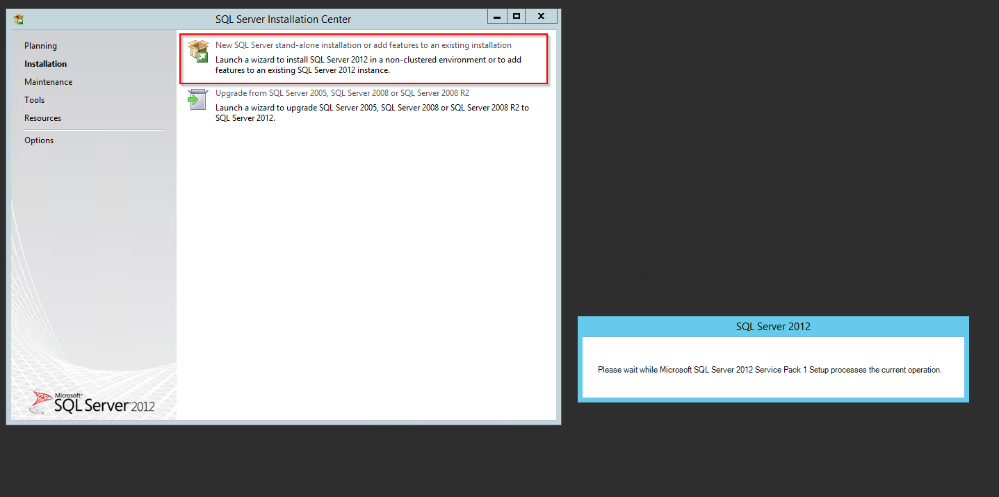

Installation
=============

.. contents:: `In this article:`
    :depth: 2
    :local:
    

Requirements
----------------------------
#. For general information on system requirements see :doc:`/Requirements`.
#. Microsoft Active Directory Service Account for accessing SIM SQL DB (in this article ``sim-svc-sql``)

.. important:: Please install all requirements before beginning with this guide! 

IIS Features
----------------------------
Execute the following command to enable IIS features on the application server:

.. literalinclude:: /_static/Install-IIS-Features.cmd
  :language: batch

For easy deploymnet: :download:`Download the script </_static/Install-IIS-Features.zip>`.

Microsoft SQL Server
----------------------------
For information about supported SQL Server versions see :doc:`/SupportedConf`

The installation of the SQL Server will be described in the following steps.

Installation Setup
^^^^^^^^^^^^^^^^^^^^
Start the SQL Server installation setup.
Choose the "New SQL Server stand-alone installation..."-Option in the follwing Window:

Throughout the installation, please choose the same features as shown below:

.. image:: _static/install/SQLServerInstallation_01.png

Name the instance SIM or choose another name:

.. image:: _static/install/SQLServerInstallation_02.png

Configure the server as follows:

.. image:: _static/install/SQLServerInstallation_03.png

Customize the Database Engine

.. image:: _static/install/SQLServerInstallation_04-1.png 

Choose the Database Engine called 'SQL_Latin_General_CP1_CI_AS': 

Select the 'mixed mode'-authentification and add your AD service account for SQL (``sim-svc-sql``) as SQL Server administrator:

.. image:: _static/install/SQLServerInstallation_05.png

You have completed the setup!

SQL Server TCP/IP Configuration
^^^^^^^^^^^^^^^^^^^^^^^^^^^^^^^^^^^^^^^^

Open the SQL Server Configuration Manager, choose 'SQL Server Network Configuration' and then 'Protocols for [Database Name]'. Change the  TCP/IP Status to *Enabled*:

Right-click the TCP/IP line and choose 'Properties':

Choose the tab "IP Adresses" and change the 'TCP Port'-entry to 1433:

Afterwards, navigate to the SQL Server Services and restart the 'SQL Server ([Database Name]):

SIM SQL DB Installation
^^^^^^^^^^^^^^^^^^^^^^^^^^^^^^^^

1. Create database ``SIM_v60_R001``
2. Grant SilverMonkey Service Account (``sim-svc-sql``) "db_owner" rights for the corresponding database

3. Import .SQL file from installation media (.\\Database) into SQL Management Studio
4. Make sure the **USE** command aims to the correct database created above and execute script

Configure IIS
-------------

Create IIS App Pool
^^^^^^^^^^^^^^^^^^^^^^^^^^^^^^^^

1. Go to IIS Manager and create an AppPool with .NET CLR version set to `v4.0*`` :

.. image:: _static/install/IISAppPool.png

Create SilverMonkey folder
^^^^^^^^^^^^^^^^^^^^^^^^^^^^^^^^

#. Create C:\\SilverMonkey
#. Copy files from installation media to **C:\\SilverMonkey\\v60\\**

Create IIS Application
^^^^^^^^^^^^^^^^^^^^^^^^^^^^^^^^

1. Add application (e.g. to DefaultWebSite), choose SIM AppPool (created above) and target to C:\\SilverMonkey\\v60\\Web\\R001. 

.. hint:: The alias defines the later URL: http://HOSTNAME/ALIAS

2. Change value ``databaseConnectionString`` to SIM v60 DB in file **C:\\SilverMonkey\\v60\\R001\\Web.Config**

Install Windows Service
-------------------------

1. Go to C:\\SilverMonkey\\v60\\WinService
2. Change value ``databaseConnectionString`` to SIM v60 DB in file **C:\\SilverMonkey\\v60\\WinService\\SilverMonkeyService.exe.config**
3. Execute **Install.cmd** with administrative rights
4. Open services.msc and make sure that the Windows Service **SIMv60Service** is installed

5. Go into the properties of this service and change the Log On Account to the Service Account. This service account is used for the execution of every plugin run by the web service.

.. image:: _static/install/SimWinService_02.png

Test Installation
----------------------------------------

