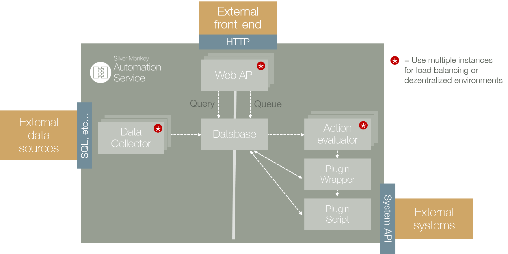
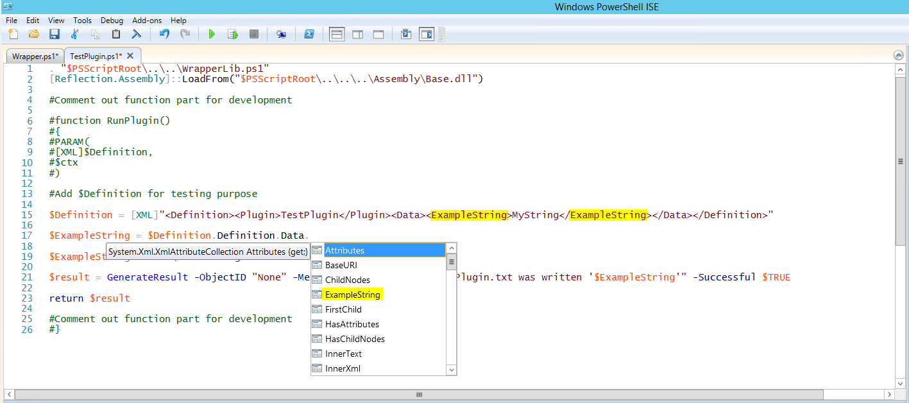

Manual for module "Webservice"
=============================================================

.. contents:: *In this article:*
  :local:
  :depth: 3

.. warning:: This article is under construction! Please DO NOT use any of the instructions below, yet! You may cause damage to your system. This article will be finished soon.

************************************************************************************
Authentication
************************************************************************************
Depending on the setting of the IIS application there are two possible authentication methods

a) Windows Authentication (recommended)
b) Authentication via firewall exception in IP base

************************************************************************************
Concept
************************************************************************************

The Webservice module consists of two main function: /queue and /query. Everything is accessable through a web api based on JSON format. 

**Queue**
For triggering and getting infos from (such as status) actions the /queue namespace have to be used.

All actions are created as planned actions in the SQL database table "queue". The "Action Evaluator" asks for planned actions. If an action is found, the Wrapper.ps1 is started with the information from ``definition`` XML and passes this data to the corresponding plugin PS1.

**Query**
For retreiving dynamic data lists /query have to be used.

************************************************************************************
Queue
************************************************************************************

Adding a queue element for executing a powershell addon script

=============================================
Creating Queue element via powershell
=============================================

.. literalinclude:: _static/CreateQueueElement.ps1
  :language: powershell

.. code-block:: powershell
  .\CreateQueueElement.ps1 -definition "<Definition><Plugin>PLUGINNAME</Plugin><Data><Parameter1>Value</Parameter1></Data></Definition>"  -url "http://HOSTNAME/AppName" 

=============================================
Creating a plugin
=============================================

For creating plugins there are several rules:

#. Every plugin must consist of a main function (with specific parameters) which will be executed by the wrapper.ps1
#. Every plugin must return a specific class, which will be created by ``GenerateResult``

.. literalinclude:: _static/PluginTemplate.ps1
  :language: powershell

For development the wrapper behaviour can be simulated by commenting out the function part, and adding the XML string directly. Once the Powershell ISE run the XML variable declaration, the XML schema is avaiable through code completion:

.. literalinclude:: _static/CreatePlugin1.ps1
  :language: powershell

************************************************************************************
Query
************************************************************************************

Getting information from the web service.

-- Information will be handed in later --

